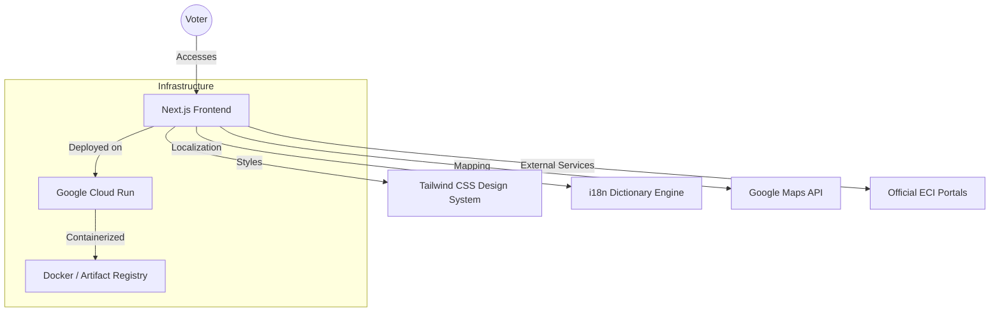
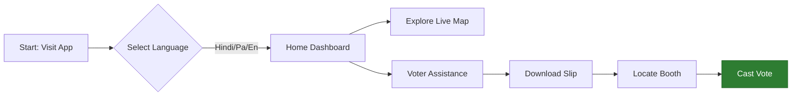

# 🇮🇳 Matdaan 360 - Your Digital Voter Companion

**Matdaan 360** is a production-ready, highly accessible digital platform designed to empower Indian voters. Built with a patriotic "Tri-color" aesthetic (Saffron, White, and Green), the platform provides real-time electoral data, localized assistance, and a clear roadmap for every citizen's voting journey.

---

## 🚀 Key Features

- **🌍 Live Constituency Mapping:** Integrated Google Maps module to visualize electoral boundaries and live polling booth locations.
- **🗣️ Multilingual Support:** Seamlessly localized in **English, Hindi (हिंदी), and Punjabi (ਪੰਜਾਬੀ)** to ensure inclusivity across diverse regions.
- **🛠️ Voter Assistance Hub:** Direct access to official ECI services including:
  - **Find Your Booth:** Real-time electoral search integration.
  - **Download Voter Slip:** Instant access to the Voter Portal.
  - **Know Your Candidate:** Transparency through the official Affidavit Portal.
- **🛤️ Voting Journey Timeline:** A visual "chain" guide that simplifies the complex electoral process into 4 actionable steps.
- **📅 Real-Time Election Updates:** State-wise live tracking of upcoming and historical election schedules (verified for 2024-2026).

---

## 🏗️ System Architecture

The application is built on a modern server-side architecture for maximum performance and security.



---

## 🛤️ User Journey Flow

How a citizen interacts with Matdaan 360 to cast their informed vote.



---

## 🛠️ Tech Stack

- **Frontend:** Next.js 15+ (App Router)
- **Styling:** Tailwind CSS (Custom High-Contrast Theme)
- **Deployment:** Google Cloud Run (Autoscaling)
- **CI/CD:** Google Cloud Build
- **Mapping:** Google Maps Javascript API / Embed API
- **Containerization:** Docker (Alpine Node 20)

---

## 📦 Deployment

The project is live and deployed on Google Cloud Run. 

**Live URL:** [https://matdaan360-639191059520.us-central1.run.app](https://matdaan360-639191059520.us-central1.run.app)

To deploy updates:
```bash
gcloud run deploy matdaan360 --source . --region us-central1 --allow-unauthenticated
```

---

## 🚦 Getting Started

1. **Clone the repo:**
   ```bash
   git clone https://github.com/shaikhwasiullah8797/MATDAAN-360.git
   ```
2. **Install dependencies:**
   ```bash
   npm install
   ```
3. **Run development server:**
   ```bash
   npm run dev
   ```
4. **Build for production:**
   ```bash
   npm run build
   ```

---

## 📄 License
This project is for educational and electoral awareness purposes. All official data is sourced from the **Election Commission of India (ECI)**.
